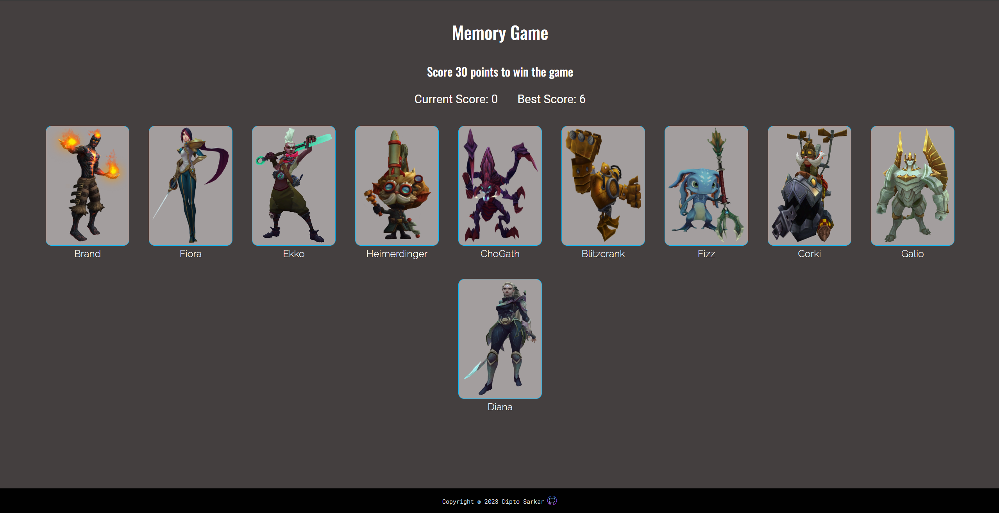

# memory_card_React
This project is about a memory game with League of Legends champions where you have to score 30 points to win. It was made with React. <a href="https://memory-card-react.vercel.app/" target="_blank">Live Demo</a>.


All the images of League Of Legends Champions were taken from <a href="https://leagueoflegends.fandom.com/wiki/List_of_champions" target="_blank">League of Legends Wiki</a>. The <a target="_blank" href="https://icons8.com/icon/52539/github">GitHub Icon</a> and the <a target="_blank" href="https://icons8.com/icon/11907/game-controller">Game Controller</a> favicon were taken from <a target="_blank" href="https://icons8.com">Icons8</a>.


## Screenshots



## Installation

1. Clone the repository
2. Go to the root folder (memory_card) of the project and run the following command to install the dependencies
   ```sh
   npm install
   ```

3. Start the server
    ```sh
    npm run dev
    ```
4. Open your browser and navigate to `http://localhost:5173/`